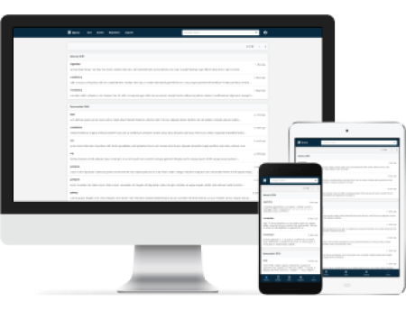

=========================

[Dnote](https://www.getdnote.com) is a lightweight personal knowledge base. The main design goal is to **keep you focused** by providing a way of swiftly capturing new information **without having to switch environment**. To that end, you can use Dnote as a command-line interface, browser extension, web client, or an IDE plugin.

It also offers a seamless **multi-device sync**, and **automated spaced repetition** to retain your memory. For more information, please see [features](https://www.getdnote.com/pricing).

## Get Started

The quickest way to try Dnote is to use the hosted version at https://app.getdnote.com

Alternatively, you can self-host a Dnote server by either [using Docker](https://github.com/dnote/dnote/blob/master/host/docker/README.md) or [using a binary](https://github.com/dnote/dnote/blob/master/SELF_HOSTING.md).

## Dnote clients

You can use the following client programs to interact with Dnote:

* [Command line interface](https://github.com/dnote/dnote/blob/master/pkg/cli/README.md)
* Chrome browser extension
* Firefox addon
* [Web interface](https://app.getdnote.com)
* Atom plugin

For the installation guide, please see the [download page](https://www.getdnote.com/download).

## What is a personal knowledge base?

A personal knowledge base is a tool used to capture the knowledge of an individual and retrieve it later.

Dnote is great for building a personal knowledge base because:

* [It is fully open-source](https://www.getdnote.com/blog/open-sourcing-dnote).
* You own your data locally using a SQLite format which is [suitable for continued accessibility](https://www.sqlite.org/locrsf.html).
* It provides a way of instantly capturing new lessons without distracting you.
* It automates spaced repetition to help you retain your memory.

You can read more in the following user stories:

- [How I Built a Personal Knowledge Base for Myself](https://www.getdnote.com/blog/how-i-built-personal-knowledge-base-for-myself/)
- [I Wrote Down Everything I Learned While Programming for a Month](https://www.getdnote.com/blog/writing-everything-i-learn-coding-for-a-month/)

## See Also

- [Homepage](https://www.getdnote.com)
- [Forum](https://forum.getdnote.com)
