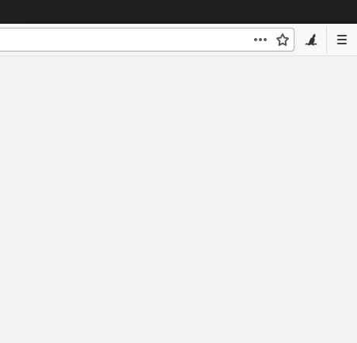

# Dnote Browser Extension

Dnote browser extension for Chrome and Firefox. Capture new information without opening a new tab or leaving your browser.

## Installation

1. Install the extension

* Firefox - https://addons.mozilla.org/addon/dnote
* Chrome - https://chrome.google.com/webstore/detail/dnote/mcfbfmihbijfaambfbbfcdcfibcjcahi

2. Login with your API key from https://dnote.io

## Overview

We learn many things while reading technical articles, or browsing StackOverflow. Unless we write them down we forget most of them exponentially.

This extension integrates seamlessly with [Dnote CLI](https://github.com/dnote/dnote/cli) and requires [Dnote Cloud](https://www.getdnote.com/pricing) account.

## Hotkeys

Write new notes without even moving your hands to the mouse.

* **Ctrl + d** - Open the extension (**Ctrl + Shift + v** on Firefox on Linux).
* **Shift + Enter** - Save the current note
* **b** - Open the saved note in the browser
